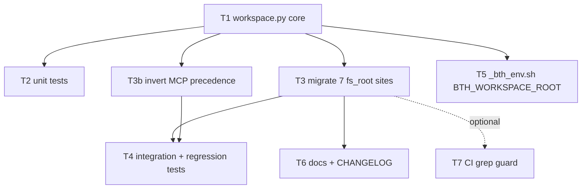

# Backlog DAG: Worktree-aware workspace resolution

- **task_id:** `260611_worktree-workspace-resolution`
- **spec:** [`../specs/260611_worktree-workspace-resolution.md`](../specs/260611_worktree-workspace-resolution.md) (REVISED, post adversarial cycle)
- **contemplex session:** `a5491650`
- **schema impact:** none · **est. size:** one sprint
- **date:** 2026-06-11

## Node table

| ID | Title | Files | Maps to AC / Risk | Depends on | Parallel? |
|----|-------|-------|-------------------|-----------|-----------|
| **T1** | `workspace.py`: `WorkspaceContext` + `resolve_workspace(cwd=None)` — 4-rung ladder (env `.expanduser().resolve()` → single all-or-nothing `git rev-parse` → recorded root → cwd) + dual-anchor `is_worktree` (relative-path-safe; submodule false-positive accepted) | `src/bathos/workspace.py` (new) | AC-1,2,4,5,6,7,9; §5.1–5.4; O8,O10 | — | root |
| **T2** | Unit tests for the resolver | `tests/test_workspace.py` (new) | AC-1..7, AC-9 + §5.3 sanity invariant (identity never from `fs_root`) | T1 | ∥ with T3,T3b,T5 |
| **T3** | Migrate the **7** `fs_root` sites to `resolve_workspace(cwd).fs_root`; leave carve-outs untouched | `compact.py:410`; `cli.py:1535/1591/1677`; `mcp.py:969/1028/1051` | AC-8,10,12; RISK-1; O1,O3 | T1 | ∥ with T3b |
| **T3b** | Invert MCP postmortem-mirror precedence: explicit `workspace_root` param wins over recorded root (remove the `:969/1028/1051` override) | `src/bathos/mcp.py` | **AC-11**; O2 | T1 | ∥ with T3 |
| **T4** | Integration + regression tests | `tests/test_postmortem.py` (extend) | AC-8 (sha256/`--strict-files` precond), AC-11, AC-10 (scoped), AC-12 | T3, T3b | after T3/T3b |
| **T5** | Export absolute `BTH_WORKSPACE_ROOT` in the SLURM env helper | `src/bathos/templates/_bth_env.sh` | RISK-2; O10 | T1 | ∥ with T3,T3b |
| **T6** | Docs: env/`.bth.toml` reference (`BTH_WORKSPACE_ROOT` absolute) + CHANGELOG; note RISK-3 + AC-12 divergence limits | `CHANGELOG.md`, docs | RISK-3; AC-12 | T3 | after T3 |
| **T7** | *(optional)* CI grep guard: `project_config.root` not used as a filesystem root outside `workspace.py` | CI config | RISK-4 | T3 | optional |

## Edges (dependency DAG)

```
T1 ──┬─→ T2
     ├─→ T3 ──┬─→ T4
     ├─→ T3b ─┘
     ├─→ T5
     └─→ T3 ──→ T6
                └─(opt)→ T7
```



## Topological order / waves

- **Wave 0:** T1 (critical path root; everything blocks on the resolver API).
- **Wave 1 (parallel after T1):** T2, T3, T3b, T5.
- **Wave 2 (after T3 + T3b):** T4, T6 *(T6 needs only T3)*, T7 *(optional)*.

**Critical path:** T1 → T3 (+T3b) → T4. Estimated 1 sprint; no data migration, no schema bump.

## Verification gates per node

- **T1:** `uv run pytest tests/test_workspace.py` red→green; resolver importable; one `git rev-parse` per call.
- **T2:** every AC-1..7/9 has a named test; sanity invariant test present and passing.
- **T3:** the 7 sites call `resolve_workspace`; grep shows no remaining `project_config.root` used as a filesystem root in the 7 sites; carve-outs (`_catalog_dir`, `_require_project_slug`, `list_outputs_tool`, `outputs_summary_tool`, `bth check`) **unchanged** (diff review).
- **T3b:** AC-11 test passes (explicit param beats discoverable `.bth.toml`).
- **T4:** AC-8 goes red on `main` HEAD (proving load-bearing) and green post-T3; AC-10 regression suite green; AC-12 documents widened scan scope.
- **T5:** helper exports an absolute path; smoke test that `BTH_WORKSPACE_ROOT` rung-1 wins.
- **Full suite:** `uv run pytest` (currently 570 passing / 4 skipped) stays green.

## Out-of-DAG (tracked separately, NOT in this sprint)

- **D1 — Shared-`bathos.db` compaction race (RISK-3 / ideas I7/I8).** Per-worktree live roots make concurrent multi-worktree compaction attractive; the latent same-machine race in `compact.py` must be addressed before that is advertised as supported. New design item.
- **D2 — Identity for non-nested worktrees (TBD-5 / O6).** Resolve catalog identity via `--git-common-dir` so worktrees created outside the repo tree stay on the same catalog. I9 territory.
- **D3 — Schema-tagged worktree provenance (idea I5).** Deferred; `git_branch`/`git_hash` already identify a worktree. Revisit only on a concrete "runs by worktree" query need.
- **D4 — Monorepo `[project] scan_root` (TBD-6).** Only if a real monorepo user needs recorded-root scan scope despite git toplevel.

## Provenance

Recon → contemplex brainstorm (`a5491650`: frame → 11-idea divergence → forcing-beat + oracle critic lenses → winner I4+I11+I10+I1-ladder → INVEST gate → finalize) → spec → spec-challenger (O1–O11) → spec-defender (adjudication: O2 & O5 design, O1/O3/O4/O6 wording, O7–O11 hardening) → revised spec → this DAG. Next step per contemplex: promote from staging to backlog, then route through the `spec_driven_dev` workflow starting at `spec_challenge`.
